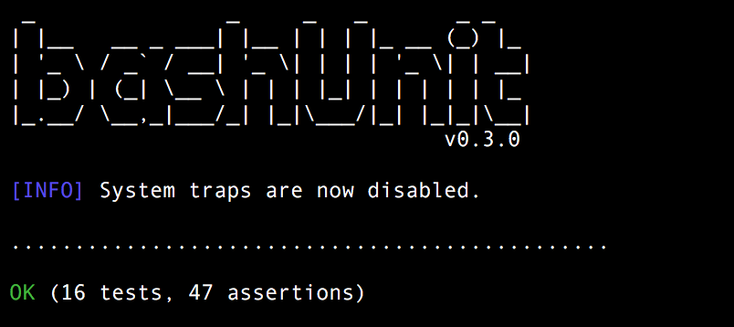

# bashUnit [](https://travis-ci.org/athena-oss/bashunit)

bashUnit is a testing framework for bash and has support for :

* Assertions on :
  * return codes
  * exit codes
  * outputs
  * values
  * strings
  * arrays
* Mocking
* Handling temporary files/directories

For the full API, please have a look at the functions in the scripts inside the lib directory and/or have a look at real testcases that use bashUnit to execute them.

## Mocking

This is a very important part of testing because it allows you to *fake* third-party functions that you don't care to test while testing your code. The best way to include these types of functions in your code, so that you can mock later, is to not use them directly, but instead, create a wrapper around it. Using this method you will be able to mock the wrapper and your code will be easy to test.

### Example: mocking grep
```bash
# in your code
function my_grep()
{
  grep $@
}

function my_function_that_uses_grep()
{
  if my_grep "val" $1; then
    return 1
  fi
  return 0
}

# in your test
bashunit.test.mock.returns "my_grep" 0
bashunit.test.assert_return "my_function_that_uses_grep" 1
```

## Testcases

For bashUnit to acknowledge a file containing tests as a *TestSuite*, you need to respect the following conventions :

  * File **MUST** follow the pattern `test.<functions_to_test>.sh`
  * Functions inside this file **MUST** follow the pattern `testcase_<name_of_the_function_to_test>()`

### Example : test.example.sh
```bash
function testcase_my_function()
{
  ...
}
```

## Assertions

You can do assertions on :

### Values
```bash
bashunit.test.assert_value "One" "One"
bashunit.test.assert_value.expects_fail "One" "Two"
```

### Output
```bash
bashunit.test.assert_output "_my_function" "OK" "pass"
bashunit.test.assert_output.expects_fail "_my_function" "OK" "fail"
```

### Return
```bash
bashunit.test.assert_return "_my_function" "pass"
bashunit.test.assert_return.expects_fail "_my_function" "fail"
```

### Exit code
```bash
bashunit.test.assert_exit_code "_my_function_with_exit_0"
bashunit.test.assert_exit_code.expects_fail "_my_function_with_exit_1"
```

### String
```bash
bashunit.test.assert_string_contains "my string" "my"
bashunit.test.assert_string_contains.expects_fail "my string" "xpto"
```

### Array
```bash
bashunit.test.assert_array expected_array result_array
```

## Other useful features

There are a few other useful features that you can use while implementing tests :

* Create temporary directories

```bash
tmpdir=$(bashunit.test.create_tempdir)
```


* Create temporary files

```bash
tmpfile=$(bashunit.test.create_tempfile)
```

## Executing the Testsuites
```bash
$ ./bashunit <target_dir|target_file> [<bootstrap_file>]
```

**Note:**
The bootstrap_file is usually where you source/load your scripts in order to be able to use them in the tests.

### Example: Running bashUnit testcases

```bash
$ ./bashunit test/
```

### Example: Successful run

```bash
$ ./bashunit test/
```


### Example: Run with some errors


```bash
$ ./bashunit test/
```


## Quick start

Prerequisites
 * You have a `bash` shell.

There are three quick start options available:

* On MAC OSX using [Homebrew](http://brew.sh/) :
```bash
$ brew tap athena-oss/tap
$ brew install bashunit
```
* [Download the latest release](https://github.com/athena-oss/bashunit/releases/latest)
* Clone the repo: `git clone https://github.com/athena-oss/bashunit.git`
